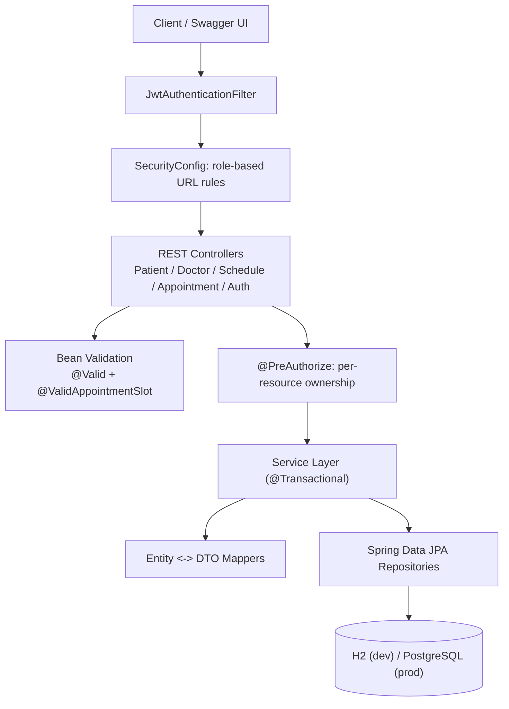

# Hospital Management System


A Spring Boot REST API for hospital appointment scheduling — patients, doctors, availability, and bookings — built around one hard problem in particular: making sure two people can never book the same doctor's slot at once. JWT authentication and role/ownership-based authorization sit on top of a booking pipeline that's backed by real pessimistic locking and proven correct under genuine concurrent load, not just reviewed by eye.

**Stack:** Java 17 · Spring Boot 4.1.1 · Spring Data JPA / Hibernate · Spring Security (JWT, BCrypt) · Bean Validation · H2 (dev) / PostgreSQL 16 (prod) · springdoc-OpenAPI / Swagger UI · JUnit 5 / Mockito / AssertJ · Docker & Docker Compose

---

## 1. What It Is

A backend service for managing patients, doctors, schedules, and appointments in a small clinic setting. Staff (`DOCTOR`/`ADMIN` roles) manage doctor records and schedules; patients log in to book, view, and cancel their own appointments. The system's core guarantee — no double-booked slots, ever, even under concurrent requests — is enforced with database-level pessimistic locking and verified with a dedicated multi-threaded test, not just assumed from the code reading correctly.

## 2. Architecture



Layered architecture: `controller` → `service` (transaction boundary) → `repository` (Spring Data JPA), with `dto`/`mapper` keeping entities off the wire and `validation`/`exception`/`security` as cross-cutting concerns.

## 3. Running Locally

### Option A — H2, no Docker (fastest)

```bash
./mvnw spring-boot:run
```

Runs on the `dev` profile (the default) — in-memory H2, no setup required.
- API: `http://localhost:8080`
- Swagger UI: `http://localhost:8080/swagger-ui.html`
- H2 console: `http://localhost:8080/h2-console`

### Option B — Docker Compose, real PostgreSQL

```bash
cp .env.example .env        # optional - edit DB_*/JWT_SECRET, or use the built-in defaults
docker compose up -d --build
```

Runs on the `prod` profile against a real Postgres 16 container. The app waits for Postgres's healthcheck (`pg_isready`) to pass before it starts — no race between the app and a database that isn't ready yet.

```bash
docker compose logs -f app   # watch it come up
docker compose down          # tear down, keep the data volume
docker compose down -v       # tear down and wipe the volume
```

## 4. Front End & Demo Walkthrough

A small hand-drawn, framework-free front end ships at `http://localhost:8080/` (`src/main/resources/static/`) — plain HTML/CSS/JS, no build step, no dependencies, calling the same REST API described below. It exists so the app can be demoed by clicking instead of curling, and includes a one-click **concurrency demo** that fires several simultaneous booking requests at the same doctor/slot so the pessimistic-locking guard's rejection of all-but-one is visible in real time, not just asserted in a test.

(The JWT also carries the caller's `patientId`/`doctorId` as a convenience claim so the UI knows whose data it's looking at — it's never trusted server-side for authorization; every access check still re-queries the database, same as before the front end existed.)

**Walkthrough, after starting the app (either option below):**

1. Open `http://localhost:8080/` and register an account with role **Admin** — no patient/doctor id needed for that role.
2. Log in, go to **Doctors → + Add doctor**, fill it in. The success toast shows the new doctor's id.
3. Add a schedule window for that doctor (e.g. Monday 09:00–17:00) so there's an open slot to book into.
4. Go to **Patients → + Add patient**, fill it in, note the id from the toast.
5. Either book on the patient's behalf while still logged in as admin, or log out, register a second account as role **Patient** with that patient id, and log back in as them.
6. Go to **Book**, pick the doctor, a date/time inside the schedule window from step 3, a reason, and submit.
7. Try **⚡ Concurrency demo** on the same panel: it fires 5 (configurable) simultaneous booking requests at the identical doctor + time. Expect exactly 1 success and the rest rejected as double-booking conflicts.
8. Check **Appointments** to see it listed, and cancel it from there.

**Other ways to exercise the API:**
- Swagger UI at `/swagger-ui.html` — log in via `/api/auth/login`, click **Authorize**, paste the token, then call any endpoint directly.
- `./mvnw test` runs the full automated suite (13 tests, see §7 below), including the same concurrency scenario as an isolated, repeatable JUnit test rather than a manual UI click.

## 5. API Overview

| Endpoint | Method | Auth | Purpose |
|---|---|---|---|
| `/api/auth/register` | POST | Public | Issue login credentials for an existing Patient/Doctor (or an ADMIN) |
| `/api/auth/login` | POST | Public | Exchange username/password for a JWT |
| `/api/patients` | POST | `DOCTOR` or `ADMIN` | Register a new patient record |
| `/api/patients` | GET | `DOCTOR` or `ADMIN`, paginated | List patients |
| `/api/patients/{id}` | GET | Authenticated (`PATIENT`: own record only) | Fetch a patient by id |
| `/api/patients/{id}/history` | GET | Authenticated (`PATIENT`: own only), paginated | Paginated appointment history, most recent first |
| `/api/doctors` | POST | `DOCTOR` or `ADMIN` | Register a new doctor |
| `/api/doctors` | GET | Any authenticated role, paginated | List doctors |
| `/api/doctors/{id}` | GET | Any authenticated role | Fetch a doctor by id |
| `/api/doctors/{id}/availability` | GET | Any authenticated role | Advisory availability check for a time window |
| `/api/doctors/{id}/schedules` | POST | `DOCTOR` or `ADMIN` | Add a schedule window for a doctor |
| `/api/appointments` | POST | Authenticated (`PATIENT`: self only) | Book an appointment (pessimistic-locked) |
| `/api/appointments/{id}` | DELETE | Authenticated (`PATIENT`: own only) | Cancel a `BOOKED`, future appointment → `204` |
| `/api/appointments/{id}/complete` | PATCH | `DOCTOR` or `ADMIN` | Mark an appointment completed |
| `/api/appointments` | GET | Authenticated (`PATIENT`: auto-scoped to own) | Search appointments by doctor/patient/date |

Full interactive docs, including request/response schemas, at `/swagger-ui.html`.

## 6. Key Design Decisions

### Why pessimistic locking for bookings
Booking has a genuine race: two requests for the same doctor at the same time must not both succeed. Optimistic locking (`@Version`) can't prevent this on its own — it only detects a row that *changed*, not a new one being concurrently *inserted*, so two transactions booking the same open slot could each see "no conflict" and both insert. The fix locks the `Doctor` row first (`SELECT ... FOR UPDATE`, via `findByIdForUpdate`), which serializes every booking attempt for that doctor before the conflict check even runs, then checks and inserts inside that lock. `@Version` is still used, separately, for the optimistic case of two staff members concurrently cancelling/completing the *same existing* appointment.

### Why `@Transactional` at the service layer
Keeps the lock acquisition, the checks, and the write inside one atomic unit — the lock is only held as long as the transaction stays open, so a thrown exception releases it immediately via rollback. Propagation is left at the default (`REQUIRED`) deliberately: it lets a future caller compose several operations into one outer transaction without forcing every booking into its own isolated one. Read-only service methods are marked `@Transactional(readOnly = true)`; simple entity updates rely on Hibernate's dirty checking rather than explicit `save()` calls.

### Why Bean Validation + a custom validator
Field-level constraints (`@NotBlank`, `@Email`, `@Past`, `@Future`) catch malformed input before it reaches business logic. One rule — "does this appointment time actually fall inside the doctor's schedule?" — can't be expressed as a field constraint, since it depends on data from another table. That's `@ValidAppointmentSlot`, a Spring-managed class-level validator that injects `ScheduleRepository` directly. It's deliberately *not* applied at the entity level: Hibernate re-validates constraints on every `UPDATE`, so an entity-level `@Future` on `scheduledAt` would break marking a past appointment `COMPLETED` — validation like that belongs on the request DTO, not the persisted entity.

## 7. Testing Strategy

Run the full suite with `./mvnw test`. 13 automated tests across four categories, chosen for what each proves rather than for a coverage percentage:

| Category | Count | Proves |
|---|---|---|
| Unit (Mockito) | 3 | `bookAppointment`'s branching logic in isolation — happy path, conflict, outside-schedule-window — with mocked repositories |
| Bean Validation | 7 | Constraint annotations actually fire: blank fields, invalid email, future birth date, past appointment time |
| Integration (`@SpringBootTest`) | 1 | The full stack against real H2 — repository, entity mapping, actual Hibernate SQL |
| Concurrency | 1 | The pessimistic lock holds under real concurrent load, not just in theory |

The concurrency test is the centerpiece: 8 threads, one patient each, gated behind a `CountDownLatch` so they all hit `bookAppointment()` at essentially the same instant, all racing for one doctor's one open slot. It asserts exactly 1 success and 7 `DoubleBookingException` outcomes, then independently re-confirms via a repository query that only one row exists at that slot — verified non-flaky across 5 standalone runs plus 2 full-suite runs.

Not yet covered: the CRUD-only services (Patient/Doctor/Schedule) and controllers directly — lower risk than the booking path, and a reasonable next addition.

## 8. Stretch Features Included

- JWT authentication (BCrypt-hashed credentials) with three roles and layered authorization: coarse role-based URL rules for simple cases, `@PreAuthorize` ownership checks (patients restricted to their own records) where a URL pattern structurally can't express the rule.
- Pessimistic *and* optimistic locking, both exercised by tests, not just present in the code.
- A custom, Spring-managed Bean Validation constraint (`@ValidAppointmentSlot`) with real repository access.
- A consistent JSON error contract across every failure path — validation, not-found, conflict, and both the security-filter-level and method-security-level flavors of 401/403, which are genuinely different code paths most implementations only handle one of.
- Multi-stage, non-root Docker build; Compose stack with healthcheck-gated Postgres startup.
- Full OpenAPI/Swagger UI documentation on every endpoint, with a working Swagger "Authorize" button for the JWT bearer scheme.
- A hand-drawn, dependency-free front end (§4) for demoing the API without Swagger or curl.

## Known Limitations

- `POST /api/auth/register` is currently public, matching an early build decision to prioritize other work — before any real deployment it should require staff authentication or a verified signup flow.
- No refresh-token flow; JWTs simply expire after 1 hour.
- `MedicalRecord` has an entity, DTO, and mapper but no REST endpoints yet.
